# Assignment 2
### Team members: 
- Nurgul Bassanova SE-2323
- Nurkasym Bolat SE-2325
- Ulzhan Tamyzgazina SE-2325

# AI Model Marketplace dApp

## Contents
1. [Overview](#overview)  
2. [Prerequisites](#prerequisites)
3. [Setup and installation](#setup-and-installation)
4. [Smart Contract Functions](#smart-contract-functions)
5. [Deployment](#deployment)
6. [FrontEnd](#frontend)
7. [Conclusion](#conclusion)
8. [Files](#files)
9. [License](#license)
10. [References](#references)

## Overview
- <b><i>Goal</i>:</b> to create a decentralized application that allows users to list, purchase, and rate AI models with UI/UI design
- <b><i>Tasks</i></b>:
1. **Smart Contract Development**  
   - Implement functions for listing, purchasing, and rating AI models.  
   - Add functionality for creators to withdraw funds and retrieve model details.  

2. **Blockchain Environment Setup**  
   - Configure `web3.js` and connect it to Ganache or a testnet like Goerli.  
   - Link Metamask to the blockchain network.  

3. **Contract Deployment**  
   - Compile and deploy the smart contract using Truffle or Hardhat.  

4. **Frontend Development**  
   - Create forms for listing models and rating purchased models.  
   - Add buttons for purchasing models, viewing details, and withdrawing funds.  
   - Display available models in a list or grid format.  

5. **Testing**  
   - Test contract functions with tools like Truffle Console or Remix.  
   - Validate frontend integration in a local blockchain environment.  

6. **Project Finalization**  
   - Deploy the application to a public testnet.  
   - Host the frontend on a platform like GitHub Pages or Vercel.  
   - Include detailed instructions in the README file.  


## Prerequisites

1. **Node.js** (version 14.x or later) - [Install Node.js](https://nodejs.org/)
2. **Ganache** - [Download Ganache](https://www.trufflesuite.com/ganache)
3. **MetaMask** browser extension - [Install MetaMask](https://metamask.io/)
4. **VS Code** - [Download VS Code](https://code.visualstudio.com/)

## Setup and installation 

### 1. Clone the repository:

```bash
git clone https://github.com/kozqarashigi/BT_assignment2
cd BT_assignment2
```
### 2. Install dependencies:

```bash
npm install
```
### 3. Set up Ganache:
- Open Ganache and create a new workspace.
- Note the RPC server URL (usually http://127.0.0.1:7545).
- Ensure you have at least two account with Ether (Ganache provides some pre-funded accounts).

### 4. Set up MetaMask:
- Open MetaMask and create a two wallets if you haven't already.
- Connect MetaMask to your local Ganache network using the RPC URL from Ganache (http://127.0.0.1:7545).
= Import one of the Ganache accounts into MetaMask using the private key provided by Ganache.


### 5. Deploy the Contract:
```bash
node server.js
```
## Smart Contract Functions
- `listModel(string memory name, string memory description, uint256 price)`: Allows users to list a new AI model.
- `purchaseModel(uint256 modelId)`: Enables users to purchase a model by its ID.
- `rateModel(uint256 modelId, uint8 rating)`: Lets users rate a purchased model.
- `withdrawFunds()`: Allows the contract owner to withdraw funds from sales.
- `getModelDetails(uint256 modelId)`: Retrieves the details of a specific AI model.

## Deployment
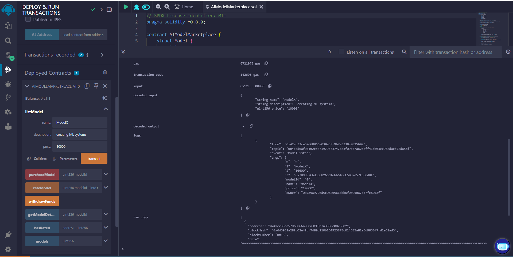

`listModel()` function and how it works: user need to input name, description of the AI model and cost of it

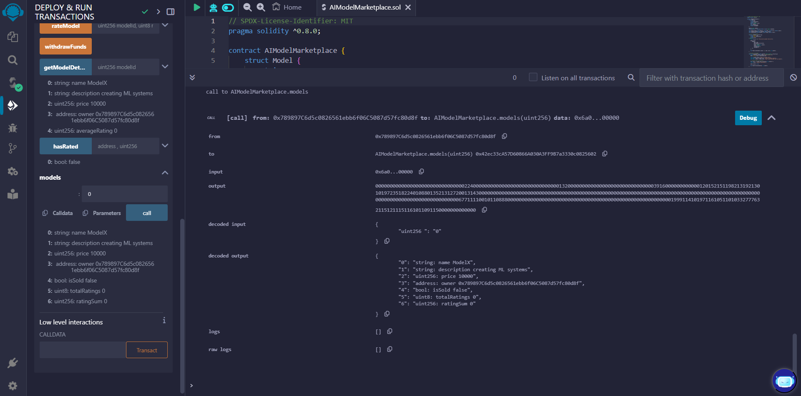

models(uint256 modelId)

Inputs:
modelId: The ID of the model (e.g., 0, 1).
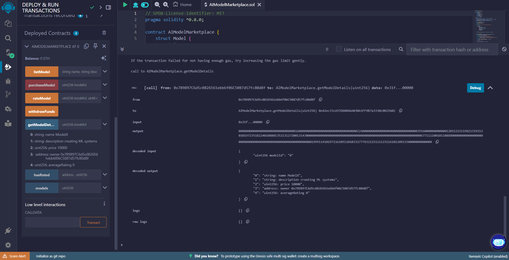

getModelDetails(uint256 modelId)

Inputs:
modelId: The ID of the model to fetch details for (e.g., 0, 1).

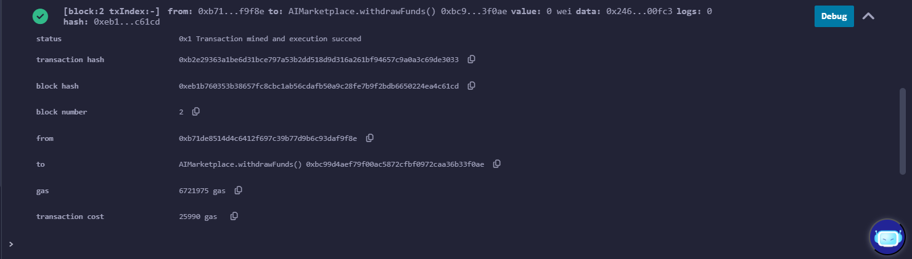

Its the ouput of withdrawFunds() function. 
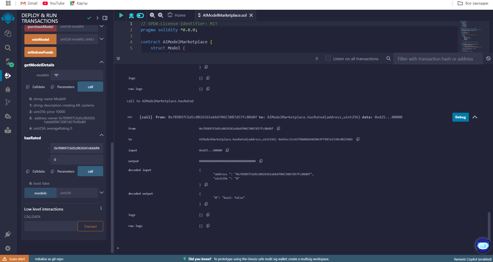

hasRated(address user, uint256 modelId) (If implemented                                              

Inputs:
user: The address of the user (e.g., 0x123...).
modelId: The ID of the model (e.g., 0, 1).


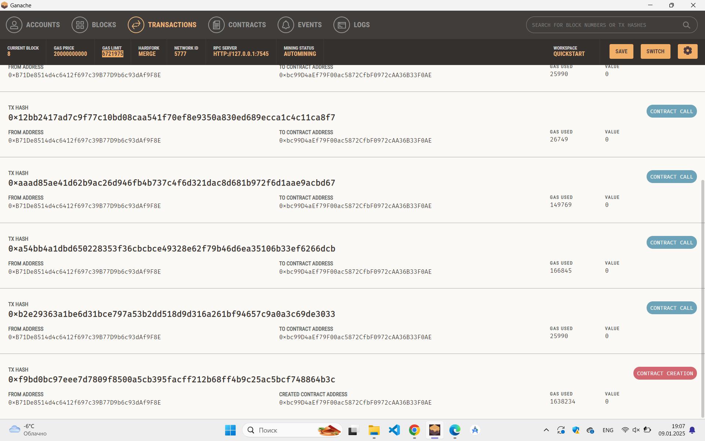

There you can see the transactions action from Meta-Mask and Ganache account.

## FrontEnd 

Main page offers users to see all the models. Each model has buttons for <b><i>accesing more details, purchasing and deleting</b></i>. Also users can add new models by pressing button <b><i>"List new model"</b></i>.
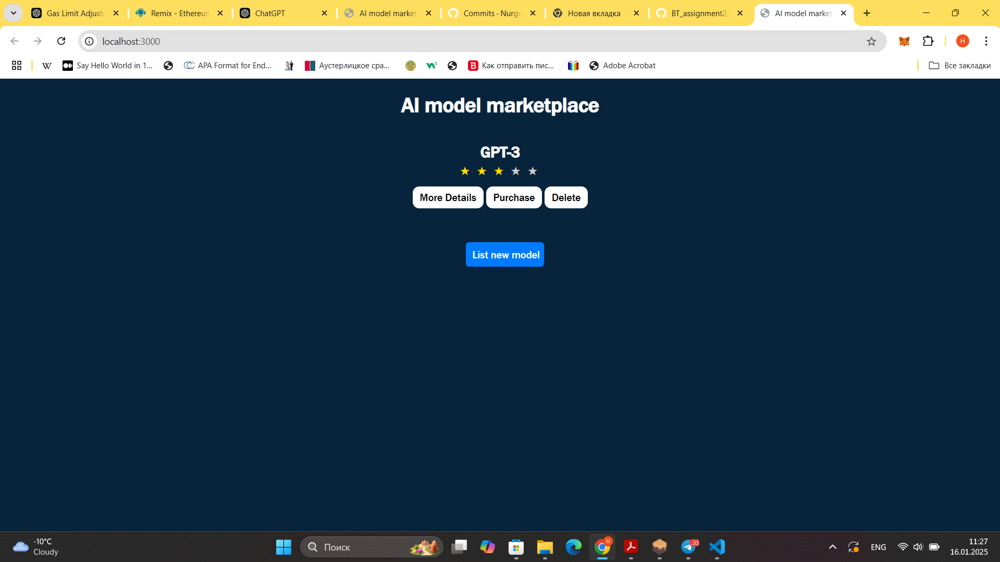

After pressing this button, it is possible to add to the list new model by entering its name, description and price.
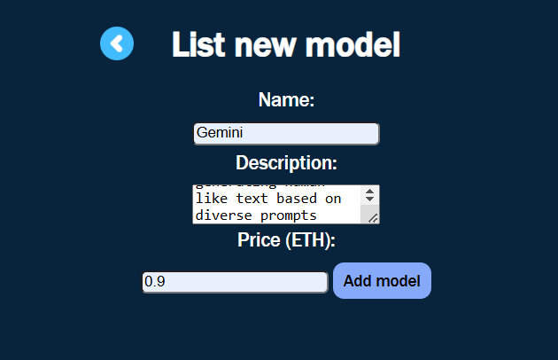

New model will be immediately added to the list.
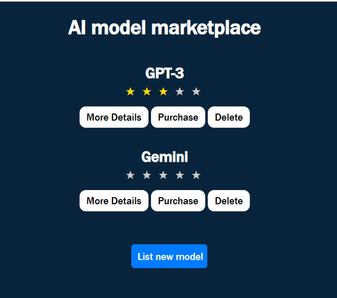

It is possible to see more details of it.
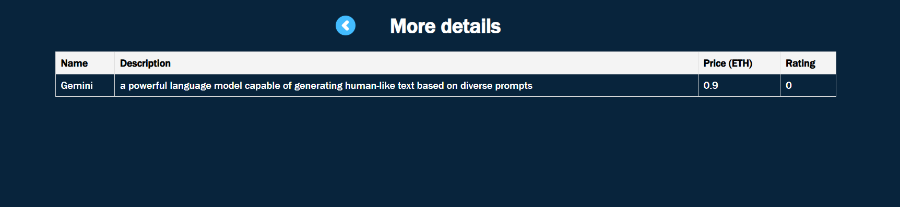

User can purchase any model for the certain price. 
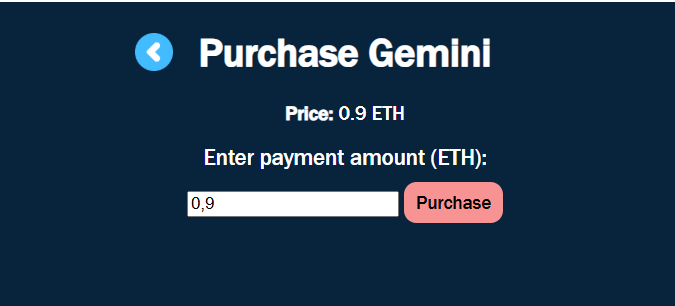

This message will be showed after successful transaction.
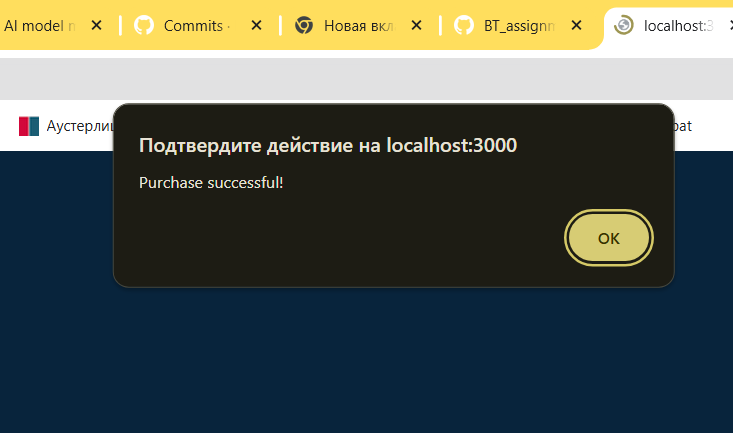

Right after the purchase, buyer must evaluate model from 0 to 5.


Then rating will be shown on the main page, as well as in the details page.
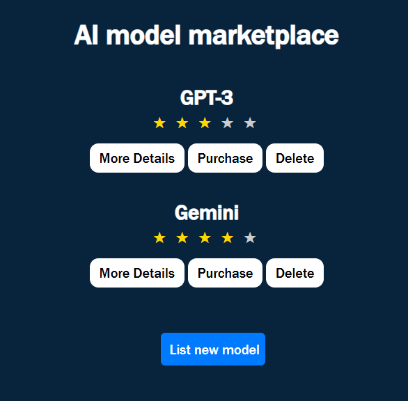
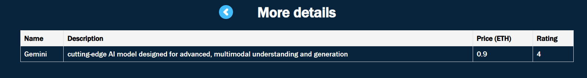

If the model is not more needed, user can delete it from the list.


## Deployment in Sepolia Network

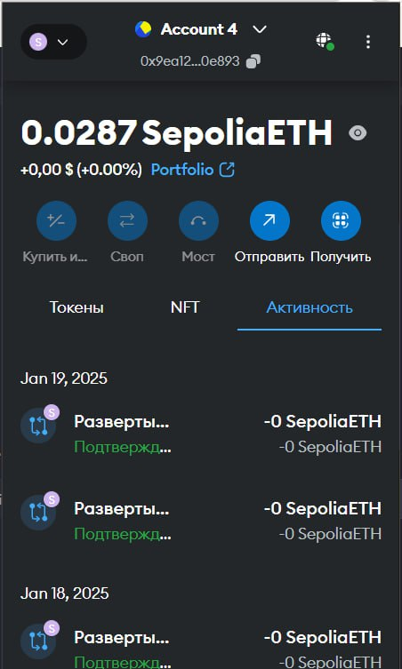

## Conclusion

This assignment successfully combines blockchain development with frontend integration to create a functional decentralized application. By implementing features such as listing, purchasing, and rating AI models, the project demonstrates the potential of smart contracts to facilitate transparent and secure transactions. The integration of `web3.js` with a user-friendly interface bridges the gap between blockchain technology and end-users.

Through this task, key skills such as smart contract development, blockchain configuration, and dApp deployment were enhanced. The project serves as a foundation for building more advanced decentralized applications, showcasing the practical application of Ethereum-based technologies. Future enhancements, such as user authentication and advanced UI features, can further elevate the platform's functionality and user experience.

Smart Contract has successful deployment on both Remix and Node.js using FrontEnd.


## Files
- server.js: Javascript script to deploy the smart contact within environment(VS code) with Ganache settings, contains all renderings of data between all pages
- views: folder for EJS files
  - index.ejs: EJS file of main page
  - details.ejs: EJS file that appears after pressing More Details button
  - purchase.ejs: EJS file that appears after pressing Purchase button
  - add.ejs: EJS file that appears after pressing List new model button
  - review.ejs: EJS file that appears after model was purchased
  - success.ejs: EJS file for success message after purchase
- public: folder for CSS files and used images
  - style.css: CSS file for styling frontend
  - back.png: image for button to come back to previous pages
- node_modules: packages installed for Node.js
- package.json: manages dependencies
- package-lock.json: generates files interactively
- screens: folder where screenshots for README are stored


## License

MIT License

Copyright (c) 2024

Permission is hereby granted, free of charge, to any person obtaining a copy
of this software and associated documentation files (the "Software"), to deal
in the Software without restriction, including without limitation the rights
to use, copy, modify, merge, publish, distribute, sublicense, and/or sell
copies of the Software, and to permit persons to whom the Software is
furnished to do so, subject to the following conditions:

The above copyright notice and this permission notice shall be included in all
copies or substantial portions of the Software.

THE SOFTWARE IS PROVIDED "AS IS", WITHOUT WARRANTY OF ANY KIND, EXPRESS OR
IMPLIED, INCLUDING BUT NOT LIMITED TO THE WARRANTIES OF MERCHANTABILITY,
FITNESS FOR A PARTICULAR PURPOSE AND NONINFRINGEMENT. IN NO EVENT SHALL THE
AUTHORS OR COPYRIGHT HOLDERS BE LIABLE FOR ANY CLAIM, DAMAGES OR OTHER
LIABILITY, WHETHER IN AN ACTION OF CONTRACT, TORT OR OTHERWISE, ARISING FROM,
OUT OF OR IN CONNECTION WITH THE SOFTWARE OR THE USE OR OTHER DEALINGS IN THE
SOFTWARE.

## References

Kacharla, B. (n.d.). Using Ganache with Remix and Metamask. Medium. Retrieved from https://medium.com/@kacharlabhargav21/using-ganachewith-remix-and-metamask-446fe5748ccf

Truffle Suite. (n.d.). Ganache blockchain. Retrieved from https://trufflesuite.com/ganache/

Web3.js. (n.d.). Deploying and interacting with smart contracts. Retrieved from https://docs.web3js.org/guides/smart_contracts/smart_contracts_guide

Web3.js. (n.d.). Documentation to Web3.js. Retrieved from https://docs.web3js.org/
